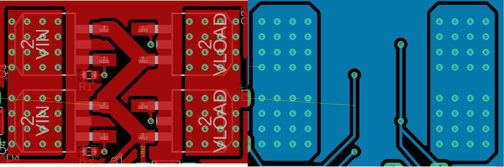

# Power Meter with 
# Protection & Visualization
#### Introduction
#### Circuit design
#### Firmware design
#### App design
#### Result
---

# Introduction
- Importance of power monitor in fields such as medical, robotics, renewable, etc.
    - Ensure correct operating ranges. 
    $\rightarrow$ Configurable ranges at run-time.
    - Visualizatoin of power/current consumption.
    $\rightarrow$ App run on client's PC/laptop.
    - Protection against damage.
    $\rightarrow$ Electronically controlled switch - MOSFET.

---
# Circuit Design
#### MOSFET selection
#### MOSFET gate driver
#### Power rail
#### Latch and overvoltage detection
#### Current sensor and MCU

--- 
## MOSFET selection
##### Switching condition
- For N-channel MOSFET (NMOS): $\quad V_{gs}>V_{th}, \quad V_{th} > 0V$
$\rightarrow$ Low-side switch

--- 
## MOSFET selection
##### Switching condition
- For P-channel MOSFET (PMOS): $\quad V_{gs}<V_{th}, \quad V_{th} < 0V$
$\rightarrow$ High-side switch

--- 
## MOSFET selection
##### On resistance $R_{ds}$
- NMOS has lower $R_{ds}$ than PMOS
- PMOS can be paralleled to reduce the total $\sum R_{ds}$

--- 
## MOSFET selection
##### Gate charge
- There exist parasitic capacitors when switching MOSFET.

- The total turn-on charge is: $Q_{on} = -[(C_{gs} +C_{gd})\cdot V_{gs, miller} - V_{signal}\cdot C_{gd}]$
- For quick prototyping, the value $Q_g$ in the datasheet can be used.

--- 
## MOSFET selection
##### Safe Operating Area (SOA)

--- 
## MOSFET selection
##### Safe Operating Area (SOA) - Region I
- Ohmic region: $V_{ds}=R_{ds}\cdot I_d$. 
- Spanning from $V_{ds}=0V$ to $V_{ds}=\dfrac{I_{d,\text{max}}}{R_{ds}}$

--- 
## MOSFET selection
##### Safe Operating Area (SOA) - Region II
- Limit by package, silicon, and $R_{\theta JA}$.
- Spanning from $V_{ds}=\dfrac{I_{d,\text{max}}}{R_{ds}}$ to $V_{ds}=\dfrac{P_{max}}{I_{d,\text{max}}}$.

--- 
## MOSFET selection
##### Safe Operating Area (SOA) - Region III & IV
- Region III: limited by $P_{\text{max}}$.
- Region IV: Limited by thermal instability.

--- 
## MOSFET selection
##### Safe Operating Area (SOA) - Design guide
Region II, III, IV is **soft-limited**
$\rightarrow$ select to be well above desired operation.
- $V_{dss} \geq 1.2\cdot V_{in}$.
- $I_{d,\text{max}} \geq 1.2\cdot I_{in}$.
- Low on resistance $R_{ds}$.

--- 
## MOSFET selection
##### Summary
- SOA is guaranteed.
- Parasitic capacitance does not vary largely.

&emsp;&emsp;&emsp;&emsp;&emsp;&emsp; PMOS &emsp;&emsp;&emsp;&emsp;&emsp;&emsp;&emsp;&emsp;&emsp;NMOS
Switch&emsp;&emsp;&emsp;High-side&emsp;&emsp;&emsp;&emsp;&emsp;&emsp;&emsp;&emsp;-Low-side$\rightarrow$ **ground offset**
&emsp;&emsp;&emsp;&emsp;&emsp;&emsp;&emsp;&emsp;&emsp;&emsp;&emsp;&emsp;&emsp;&emsp;&emsp;&emsp;&emsp;&emsp;&nbsp; -Can be used as high-side
&emsp;&emsp;&emsp;&emsp;&emsp;&emsp;&emsp;&emsp;&emsp;&emsp;&emsp;&emsp;&emsp;&emsp;&emsp;&emsp;&emsp;&emsp;&nbsp; but more complex

$R_{ds}$&emsp;&emsp;&emsp;&emsp;&nbsp; High$\rightarrow$ improve by&emsp;&emsp;&emsp;&emsp;Low
&emsp;&emsp;&emsp;&emsp;&emsp;&emsp; paralleling

--- 
## MOSFET selection
##### IRF4905S
The following MOSFET is chosen beacause:
- suitable $V_{dss}$ and $I_{d,\text{max}}$.
- low $R_{ds}$ among PMOS.

--- 
## MOSFET selection
##### Reverse polarity protection
Create by connecting Drain to $V_{in}$ and Source to load.
- The body diode (N-Type Substrate and P-Type Drain) allows a current path if $V_{d} > V_{s}$.
- When a reverse polarity is applied, $V_{gs}>0V$, MOSFET in cut-off.

---
## MOSFET gate driver
##### Objective
- Slow turn-on & quick turn-off.
- Driven in deep saturation, $V_{gs} \approx -V_{in}$

---
## MOSFET gate driver
##### A naive approach:

---
## MOSFET gate driver
##### Proposed gate driver

---
## MOSFET gate driver
##### Proposed gate driver
On HIGH input, BJT $T2$ is saturated, pulling $R6$ to ground, cutting off $T1$. Thus, discharging the MOSFET's gate through $R5$.

---
## MOSFET gate driver
##### Proposed gate driver
On LOW input, BJT $T2$ is cut off, current flows through $R6$ to the bas off $T1$, turning it on. Thus, charging the MOSFET's gate.

---
## Power Rail
- Hyrbid approach of switching LM2596 and LDO L7805 regulator.
- Use Isolated DC-DC Converter B0505S-2WR2 to power the MCU.

---
## Latch circuit
- The following diagram shows the logic of the desired latching behaviour.
- If design with logic ICs, at least 4 ICs, and unused gates

---
## Latch circuit
##### Single op-amp latch design

---
## Latch circuit
##### Single op-amp latch design

---
## Current sensor INA226
##### Features
- All-in-one solution for power monitor application.
- Shunt-based with wide measurement range $[-81.975mV; 81.92mV]$ & 16 bits ADC.
- I2C communication.
- Programmable Alert function and limit with output on pin ALE.

---
## Current sensor INA226
##### Setup
- High-side measurement.
- Bus voltage measured at load $\rightarrow$ VBUS and IN- shorted.
- Alert function monitors power, outputs if set limit is exceeded.

---
## ESP32-C3 development board
##### Features
- UART-to-USB converter and LDO converter.
- On-board antenna for WiFi connectivity.
- On-board RGB LED (tied to GPIO3, GPIO4, GPIO5).

---
## ESP32-C3 development board
##### Digital isolation
To use with other components such as the latch circuit and INA226, a digital isolator IC and an I2C isolator IC are required.
- **ADUM3201ARZ** from Analog Devices Inc.
- **ISO1540** from Texas Instruments Inc

---
## PCB layout
##### Thermal via for TO-263/D2PAK

---
## PCB layout
##### Amass XT60PW connectors
- Directional.
- Anti-spark.
- Pressed fit connection.

---
## Firmware Design
##### Setup

---
## Firmware Design
##### read_sensor_task

---
## Firmware Design
##### send_data_task

---
## Firmware Design
##### check_user_input_task

---
## Application
##### Model-View-Controller

---
## Application
##### Framework

- The main framework is **Flask**.
- **Celery** is used to run background task, capturing incoming UDP packets and store for visualization.

---
## Application
##### Controller's behaviour
The controller will wait for the following requests:
- HTTP GET **/esp32_post**: Collect all data points up until request, and send to client.
- HTTP POST **/sensor_config**: Encode & "redirect" to the MCU.
- HTTP POST **/switch_off**:    "redirect" to the MCU.

---
## Application
##### View's design
- **Bootstrap 5** provides elements to design a modern UI.
- **Plotly.js** is used to graph the data.
- **AJAX** allows for update of elements without reloading the webpage.

---
## Application
##### View's design - index

---
## Application
##### View's design - config

---
# Result
#### Gate driver's transient
#### Power rail's component failure
#### Latch circuit
#### Firmware and Application

---
## Result
##### Gate driver's transient
The following is the voltage traces of the drain voltage (green) and the gate (yellow) voltage of the MOSFET during a turn-off event.
.

---
## Result
##### Gate driver's transient
Recall the gate capacitance calculation, $V_{gs,miller}$ can be calculated:
$$V_{gs, miller} = V_{signal}\left[\exp{\left(-\dfrac{\Delta t_{0\rightarrow2}}{R_{g}(C_{gs} +C_{gd})}\right)}\right]$$
- In the datasheet, $C_{gs} +C_{gd} = C_{iss}(V_{ds}) = 1448pF$
- $V_{gs, miller}=V_{g, miller} - 15V$
- In the proposed gate driver topoloy, the gate is pull-up to supply voltage, thus, $V_{signal} = V_{in} = 15V$.

---
## Result
##### Gate driver's transient
$\qquad V_{g, miller} - 15V = V_{signal}\left[\exp{\left(-\dfrac{\Delta t_{0\rightarrow2}}{100k\Omega\cdot 1448pF}\right)}\right]$
$\Leftrightarrow V_{g, miller} = V_{signal}\left[\exp{\left(-\Delta t_{0\rightarrow2}\cdot 6900 s^{-1}\right)}\right] + 15V \geq 15V,\quad \forall t_{0\rightarrow2}$
Let:
$\qquad\qquad \Delta t_{0\rightarrow2} \in [100\mu s;200\mu s] \Leftrightarrow V_{g, miller} \in [1.25V_{in}; 1.5V_{in}]$

The above range for $V_{g,miller}$ agrees with the measured response.

**Solution:** snubber circuit to decrease $dv/dt$ of $V_{ds}$ at device turn-off.

---
## Result
##### Power rail's components failure
- LM2596 was not sourced from trusted vendor causes fluctuating $V_{ref\_LM2596} \in [1.0V; 1.23V]$ leads to:
    - Fluctuating $V_{out,sw}$.
    - Higher $P_{loss}$ at the LDO stage.
- B0505S-2WR2 cannot maintain 5V output when the MCU is connected.
$\rightarrow$ The MCU has to be powered externally.

---
## Result
##### Latch circuit
- Overlapping of on and off source was not accounted for.
- Possible solution:
